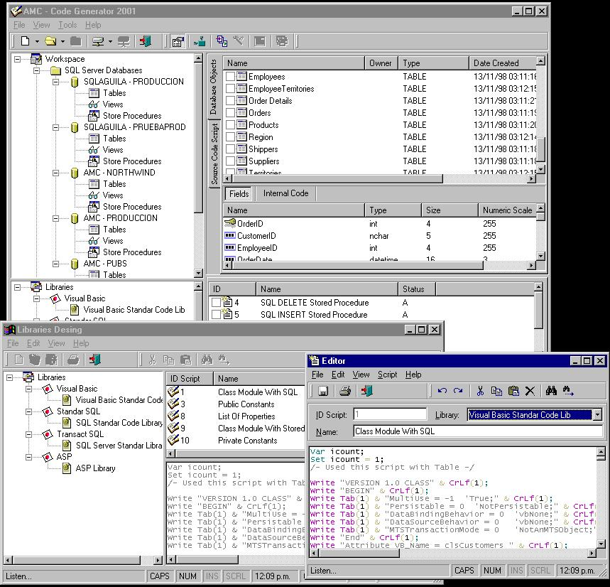

<div align="center">

## AMC Code Generator 2001 V 1\.0\.0 \(Download\)


</div>

### Description

Pleasee, download this source code by http://www.sourcecode4free.com/upload/filepages.asp?fileid=2433

In Planet Source Code Not Upload the Dll for Interpreting scripts

Thanks..
 
### More Info
 


<span>             |<span>
---                |---
**Submitted On**   |
**By**             |[Alfredo Martinez C\.](https://github.com/Planet-Source-Code/PSCIndex/blob/master/ByAuthor/alfredo-martinez-c.md)
**Level**          |Advanced
**User Rating**    |5.0 (15 globes from 3 users)
**Compatibility**  |VB 5\.0, VB 6\.0
**Category**       |[Complete Applications](https://github.com/Planet-Source-Code/PSCIndex/blob/master/ByCategory/complete-applications__1-27.md)
**World**          |[Visual Basic](https://github.com/Planet-Source-Code/PSCIndex/blob/master/ByWorld/visual-basic.md)
**Archive File**   |[](https://github.com/Planet-Source-Code/alfredo-martinez-c-amc-code-generator-2001-v-1-0-0-download__1-24756/archive/master.zip)


### Source Code

```
Pleasee, download this source code by http://www.sourcecode4free.com/upload/filepages.asp?fileid=2433
In Planet Source Code Not Upload the Dll for Interpreting scripts
Thanks..
```

